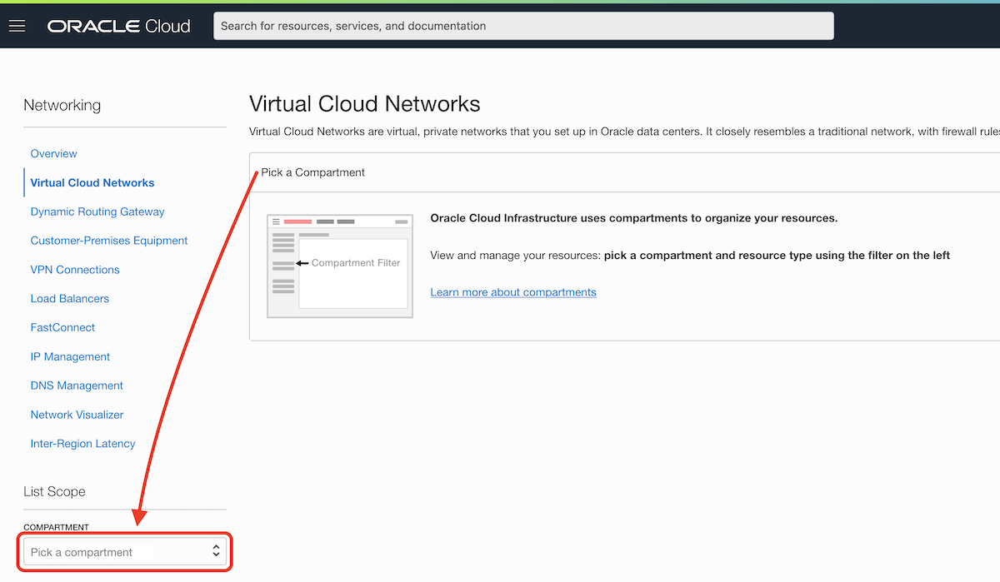
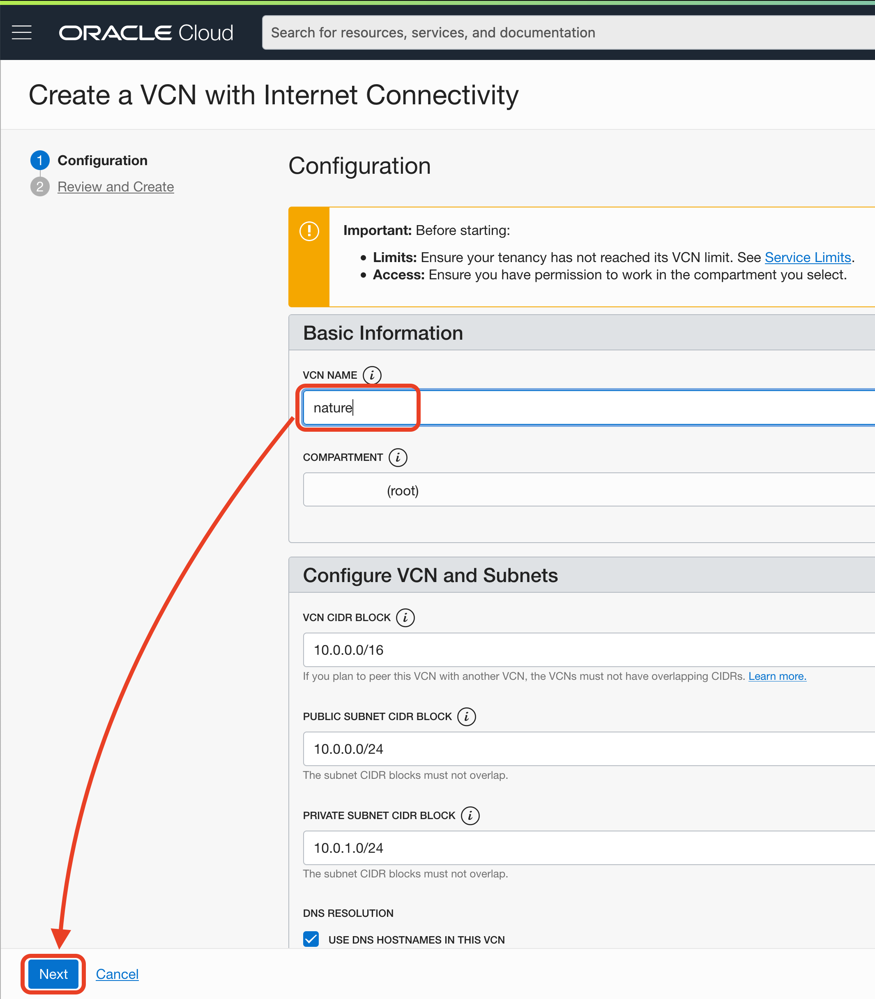
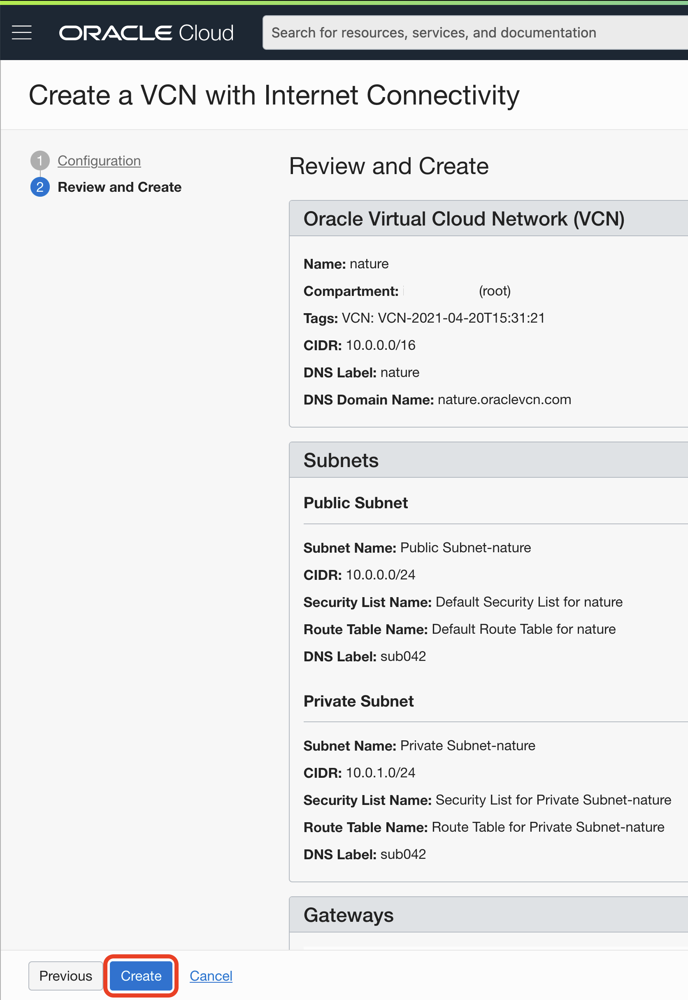
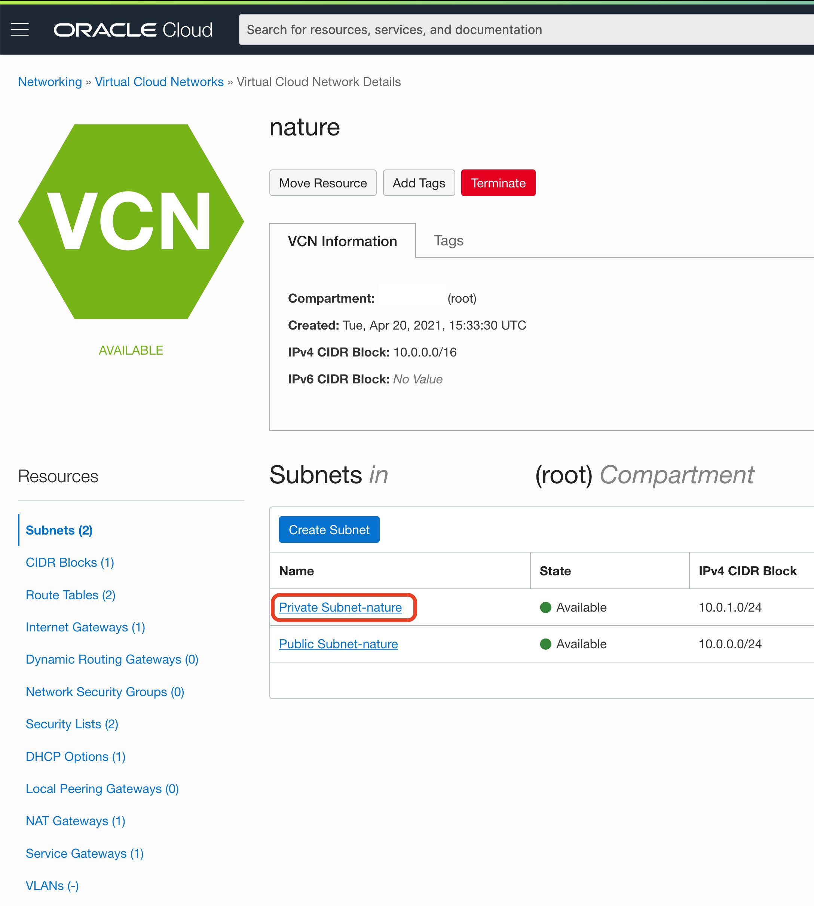
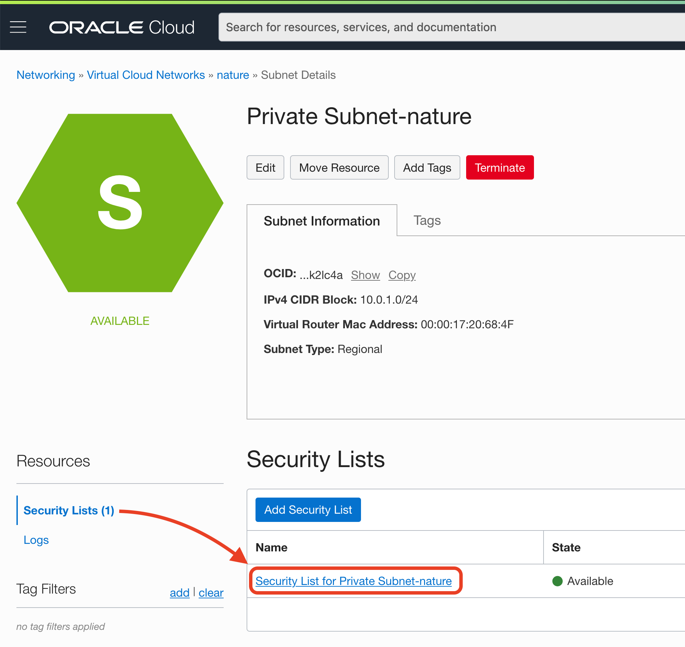
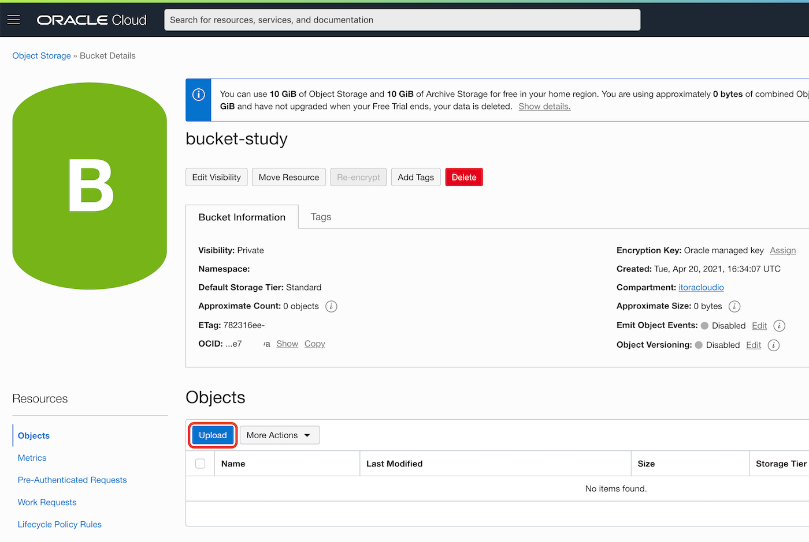
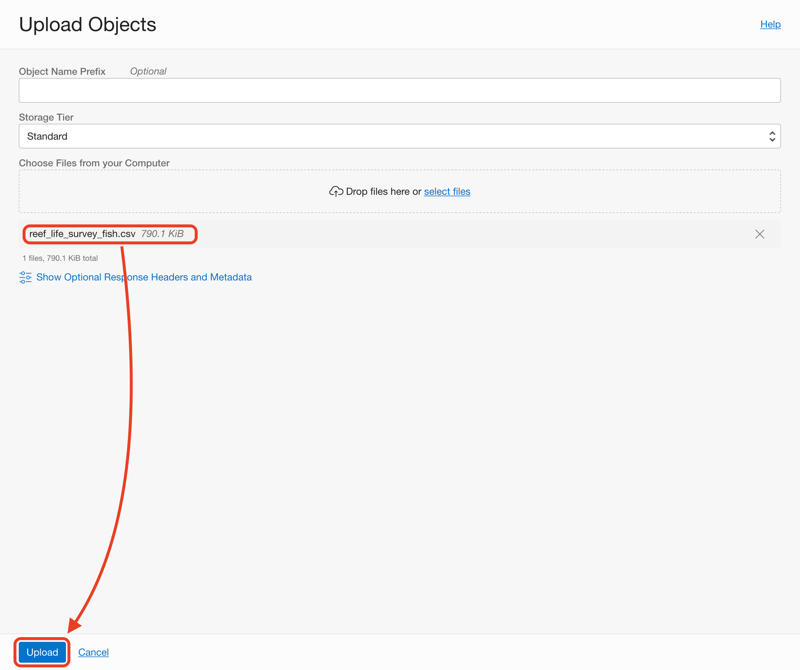
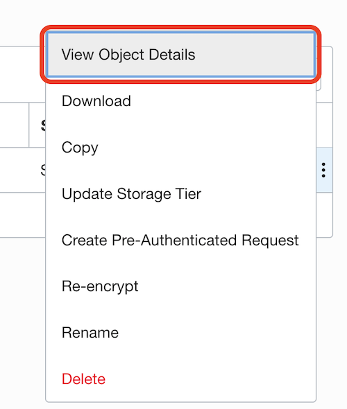
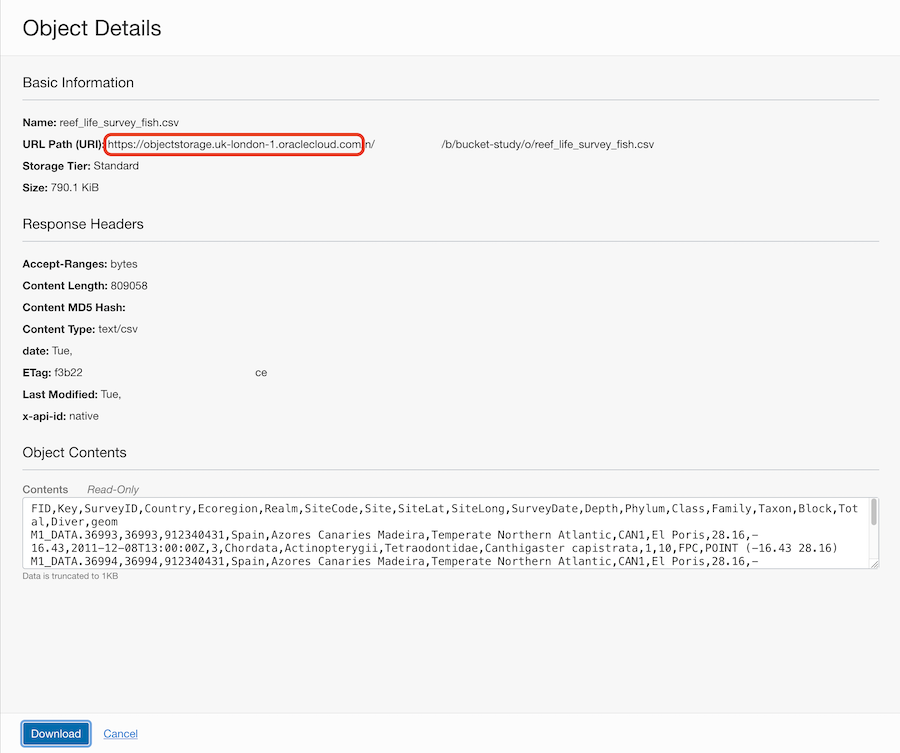

# Lab 1: Requirements


## Create Virtual Cloud Network (VCN)

We are going to create a network with a public subnet (with access from the Internet) and a private subnet (no direct access from the Internet).

This network layout is interesting to protect those services that don't need to be exposed to the Internet (living in the Private subnet) meanwhile other services and virtual machines with direct access from the internet, like Bastion hosts or Web Servers (living in the Public Subnet).

Go to **Menu** > **Networking** > **Virtual Cloud Networks**.


> If you have not picked a compartment, pick the **root** compartment for this Lab.
> 
> 

Click **Start VCN Wizard**.


Select **VCN with Internet Connectivity**.

Click **Start VCN Wizard**.


Change the VCN name and leave everything else as default.

VCN Name: 
```
nature
```

Click **Next**.



Review all the details and click **Create**.



The creation process takes few seconds. Confirm everything is created (green tick on all resources) before you continue.

Click **View Virtual Cloud Network**.


Go to your new **Private Subnet-nature**.



Click **Security List for Private Subnet-nature**.




We need to open the ports for MySQL and MySQL X protocols: `3306` and `33060`.

Click **Add Ingress Rules**` and fill the form with the following information:


We are adding an ingress rule on those ports from the internal VCN CIDR `10.0.0.0/16`.

Source CIDR: 
```
10.0.0.0/16
```

Destination Port Range: 
```
3306,33060
```

Description: 
```
MySQL and MySQL X Protocol
```

Leave the rest of the fields with default values.

And click **Add Ingress Rule** to confirm the values.


You can confirm the rules are added.


---

## Create Bastion Host

We are going to create a compute instance in the Public Subnet with a public IP; it will be our access point to public and private resources.

Go to **Menu** > **Compute** > **Instances**.


Click **Create Instance**.


Change the name to:

```
bastion
```

Make sure the rest of the properties are like the following:

Image: 
```
Oracle Linux 7.9
```

Shape for Always Free: 
```
VM.Standard.E2.1.Micro
```

Alternative Shape cloud be:
```
VM.Standard.E3.Flex
```

Virtual cloud network: 
```
nature
```

Subnet: 
```
Public Subnet-nature
```

Assign a public IPv4 address: 
```
Yes
```


On the section Add SSH Keys

Make sure **Generate SSH Keypair** is checked.

Click **Save Private Key** and **Save Public Key**.

After the files are stored on your computer, click **Create**.


The provisioning takes few minutes.


You can copy the assigned Public IP that we will use to SSH into the instance, also notice that the username is `opc`.

Make sure the Icon turns green, and it says "RUNNING".


To avoid install tools on your local computer, we are going to use Cloud Shell. Cloud Shell is a small and free Linux virtual machine with a lot of DevOps tools preinstalled that Oracle Cloud offers.

Click on the **Cloud Shell** icon on the top-right menu bar.


It will provision this small virtual machine, and you will have access to its terminal from the Oracle Cloud Web Console.


Click on the Cloud Shell **menu** icon and then in **Upload**.


Click on **select from your computer**. And select the private key you downloaded for the compute instance.


After you Upload the file you can **Hide** the message.


On Cloud Shell terminal, create `.ssh` folder for your SSH keys.

```
mkdir .ssh
```

Move the key file to your `.ssh` folder with a different name, `id_rsa`, which is a default name.

```
mv ssh-key-*.key .ssh/id_rsa
```

Connect with your bastion host with SSH. The `PUBLIC_IP` was copied when the bastion host was created.

```
ssh opc@PUBLIC_IP
```

To the question `Are you sure you want to continue connecting (yes/no/[fingerprint])?` type `yes` and ENTER.

You will most likely get a `bad permissions` warning. Basically the permissions of the key are too open.

```
Warning: Permanently added 'xxx.xxx.xxx.xxx' (ECDSA) to the list of known hosts.
@@@@@@@@@@@@@@@@@@@@@@@@@@@@@@@@@@@@@@@@@@@@@@@@@@@@@@@@@@@
@         WARNING: UNPROTECTED PRIVATE KEY FILE!          @
@@@@@@@@@@@@@@@@@@@@@@@@@@@@@@@@@@@@@@@@@@@@@@@@@@@@@@@@@@@
Permissions 0644 for '/home/it/.ssh/id_rsa' are too open.
It is required that your private key files are NOT accessible by others.
This private key will be ignored.
Load key "/home/it/.ssh/id_rsa": bad permissions
Permission denied (publickey,gssapi-keyex,gssapi-with-mic).
```

Security first, let's fix the permissions to `600` with the following command:

```
chmod 600 .ssh/id_rsa
```

Connect with SSH again (remember to replace `PUBLIC_IP` with your bastion host IP):

```
ssh opc@PUBLIC_IP
```

This time you should be inside of the bastion host. This is the machine we will use to access MySQL Database System that lives in a private subnet.

Install Docker:

```bash
sudo yum update -y && sudo yum install docker-engine -y
```

Start Docker Engine:

```
sudo systemctl start docker
```

Check it is running:

```
sudo systemctl status docker
```


If `active`, then enable Docker as a service.

```
sudo systemctl enable docker
```

 Optional, if you don't want to use `sudo` with every `docker` command:
>
> ```
> sudo usermod -aG docker $USER
> ```
> 
> For the changes to take place, you need to `exit` and then `ssh` into the bastion host again

Let's pull MySQL as a docker container:

```
sudo docker pull mysql/mysql-server
```

You can close Cloud Shell for now.

---

## Create Object Storage and upload files

Go to **Menu** > **Object Storage** > **Object Storage**.


Click **Create Bucket**.


Change the bucket name, leave everything else by default.

Bucket Name: 

```
bucket-study
```

Click **Create**.


Click on your new `bucket-study` bucket to see details.


On the section **Objects**, click **Upload**.



Download the dataset [Reef Life Survey Fish](./files/reef_life_survey_fish.csv).

Drop the file on **Choose Files from your Computer**. Leave everything else by default.


Click **Upload**.



Click **Close**.

You will see the new file in the Objects list. Click on the three dots contextual menu.


On the contextual menu, select **View Object Details**.



Take note of the URL you have. We will use it in the following Labs.



## Congratulations! You are ready to go to the next Lab!

---

[**<< Go to Sign Up**](../lab0/README.md) | [Home](../README.md) | [**Go to Lab 2 >>>>>**](../lab2/README.md)
