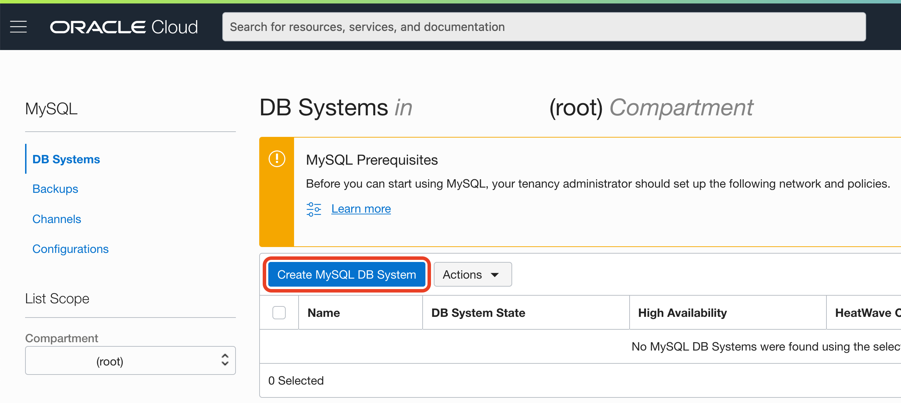

# Lab 2: Create MySQL Database System

**MySQL Database System** is a fully-managed Oracle Cloud Infrastructure service, developed, managed, and supported by the MySQL team in Oracle.

## Create an instance of MySQL in the cloud

Go to **Menu** > **Databases** > **DB Systems**.

Click **Create MySQL DB System**.

Make sure your root compartment (or the one you want) is selected.

- Name your MySQL instance: `mysql-analytics`

- Description (optional): `MySQL instance for Analytics`

Between the three options, pick `HeatWave`. `Standalone` will work for the test, but it doesn't include the Analytics Engine that will improve performance for Analytics.

For Username and password:

- Username: `root`

- Password: `R2d2&C3po!`

- Confirm Password: `R2d2&C3po!`

Network configuration:

- Virtual Cloud Network: `nature`

- Subnet: `Private Subnet-nature (Regional)`

Everything else is good by default:

- Configure placement: `AD-1`

- Configure hardware: `MySQL.HeatWave.VM.Standard.E3` or Standalone (selected above) `MySQL.VM.Standard.E3.1.8GB`

- Data Storage Size (GB): `50`

- Configure Backups: `Enable Automatic Backups`

Click **Create**.

The provisioning is around 10 minutes. The icon should change to `ACTIVE` in green:

Copy the private IP address from the MySQL DB System Information page; it will look like `10.0.1.xxx`.

## Connect and create DB

Connect with Cloud Shell (if you close it or it is no longer active).

- SSH into the bastion host: `ssh -i ~/.ssh/bastion opc@PUBLIC_IP`

- Run MySQL Shell (repalce `PRIVATE_IP` with your MDS IP value): `curl https://raw.githubusercontent.com/vmleon/mysql-dataintegrator-datascience-workshop/main/lab2/files/create_fish_survey.sql | mysqlsh --sql root@10.0.1.112`

It will ask for the password (`Please provide the password for 'root@PRIVATE_IP':`). 

- Type the MySQL DB password: `R2d2&C3po!`

If there is no error on the console, everything is ready to proceed.

## Enable HeatWave

If you have select the HeatWave Shape `MySQL.HeatWave.VM.Standard.E3`, you should be able to enable HeatWave Analytics Engine.

Go to the **Resources Menu** > **HeatWave**.

Your HeatWave is disabled, add the HeatWave Cluster. Click **Add HeatWave Cluster**.

Check the values, and click **Add HeatWave Cluster**.

Wait for the Cluster to be created.

HeatWave will be `Active` and the cluster nodes will be as well in `Active` state.

## Congratulations! You are ready to go to the next Lab!

---

[**<< Go to Lab 1**](../lab1/README.md) | [Home](../README.md) | [**Go to Lab 3 >>>>>**](../lab3/README.md)